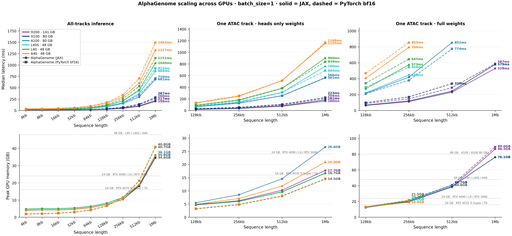
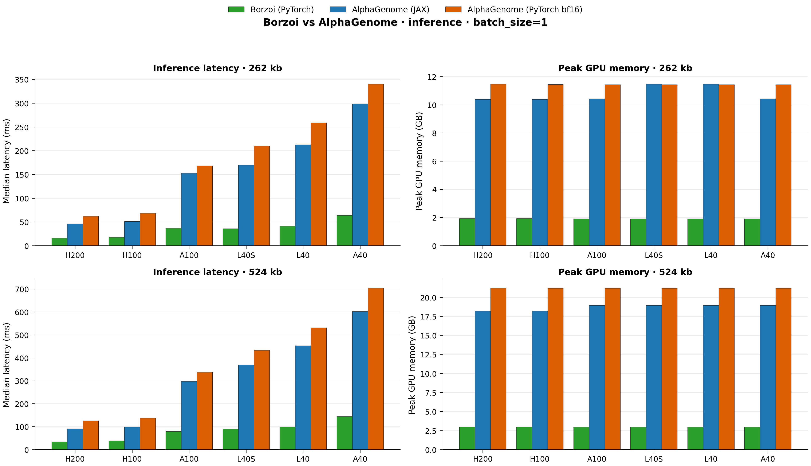


[AlphaGenome](https://deepmind.google/discover/blog/alphagenome-a-foundation-model-for-genome-biology/) pushes genomic modeling to sequence lengths up to `1 Mb`, but practical adoption still comes down to a simple question: what fits on the GPU you actually have, and how long will it take?

This post benchmarks the official JAX implementation and the community PyTorch port across seven NVIDIA GPUs: `H200 (141 GB)`, `H100 (80 GB)`, `A100 (80 GB)`, `L40S (48 GB)`, `L40 (48 GB)`, `A40 (48 GB)`, and `RTX 6000 (24 GB)`. We report inference, heads-only finetuning, and full-weights finetuning on real genomic workloads.

Key takeaways:

* Inference up to `1 Mb` is feasible on every tested GPU from `48 GB` upward; `1 Mb` typically requires about `35-41 GB` of peak memory
* Heads-only finetuning fits on every tested GPU up to `1 Mb`, making it the accessible adaptation path for most labs
* Full-weights finetuning is memory-bound: `1 Mb` is comfortable on `H200`, borderline on `H100`, reaches `524 kb` on `80 GB` cards otherwise, and tops out at `262 kb` on `48 GB` cards
* Above about `131 kb`, memory scaling is close to linear for all three workloads


---

## Overview

[AlphaGenome](https://deepmind.google/discover/blog/alphagenome-a-foundation-model-for-genome-biology/) is a 450-million-parameter foundation model for genome biology released by Google DeepMind. It processes DNA sequences up to `1 Mb` and predicts thousands of genomic tracks, from chromatin accessibility to 3D contact maps, at base-pair resolution. The official implementation is in JAX; a [community PyTorch port](https://github.com/genomicsxai/alphagenome-pytorch) makes the model accessible to the broader PyTorch ecosystem. We are contributors to that PyTorch port.

This post is a community reference: if you want to run AlphaGenome and are trying to figure out what fits on the GPU you have and how long it will take, this is where we share the numbers. We profile both the official JAX path (`alphagenome-jax`) and the community PyTorch port (`alphagenome-pytorch`, running in bf16) across seven NVIDIA GPUs under three workloads: inference, heads-only finetuning, and full-weights finetuning, each on real genomic data.

For background, see two companion posts: [Fine-tuning AlphaGenome in native JAX/Haiku](https://genomicsxai.github.io/blogs/2026-003/) (the `alphagenome-ft` community package) and [Porting AlphaGenome to PyTorch](https://genomicsxai.github.io/blogs/2026-004/) (the PyTorch port benchmarked here). DeepMind released the weights and JAX research code ([`alphagenome_research`](https://github.com/google-deepmind/alphagenome_research)); the PyTorch port, `alphagenome-ft`, and this benchmarking effort are all community work. Our JAX finetuning runs are built on `alphagenome_research` directly, not through `alphagenome-ft` — `alphagenome-ft` wraps the same research code and should land on similar performance, but it is a separate package and not what these numbers measure.

> **Side note — what is "latency"?** Throughout this post, *latency* means the wall-clock time for a single compiled model step on the GPU (one forward pass for inference, one forward + backward + optimizer step for finetuning). All latency numbers are reported in milliseconds (`ms`). *Peak memory* is the maximum GPU memory the step ever held, reported in gigabytes (`GB`).

## Motivation

Researchers adapting AlphaGenome to their own tasks face a concrete planning question: "my lab has GPU X, what sequence lengths can I run, how long will each iteration take, and how much memory do I need to budget?" That question is hard to answer without running the model yourself, and the GPU landscape in academic clusters is diverse. Not every group has access to H200s or even A100s.

We ran controlled, reproducible benchmarks across the GPU tiers most commonly found in academic and cloud environments to make that question easier to answer. Both the official JAX implementation and the community PyTorch port are profiled so that the results are useful regardless of which path a lab is already using. Every number in this post comes from published, tracked benchmark runs that can be reproduced from [our profiling repository](https://github.com/XinmingTu/genomic-model-profiling).

## Benchmark Setup

### Models

* `alphagenome-jax`: the official DeepMind JAX/Haiku implementation, compiled with `@jax.jit`. Finetuning uses code adapted from DeepMind's [`alphagenome_research`](https://github.com/google-deepmind/alphagenome_research) research-code release (the same backbone `alphagenome-ft` is built on), wrapped in a minimal custom training loop for these benchmarks
* `alphagenome-pytorch`: the community [PyTorch port](https://github.com/genomicsxai/alphagenome-pytorch) from the Kundaje Lab, compiled with `torch.compile` and bf16 autocast; finetuning runs are a straightforward training loop built directly on that implementation
* [Borzoi](https://github.com/calico/borzoi) is also benchmarked at its supported sequence lengths (`262 kb` and `524 kb`) using [`borzoi-pytorch`](https://github.com/johahi/borzoi-pytorch) (pretrained weights `johahi/borzoi-replicate-0`) — a third-party community PyTorch reimplementation by Johannes Hingerl (Gagneur lab, TU Munich) — **not** the original Calico TensorFlow release, so that the Borzoi and AlphaGenome-PyTorch numbers share the same framework stack; see [Also published: Borzoi](#also-published-borzoi)

### GPUs

We test on seven NVIDIA GPUs spanning Turing, Ampere, Ada Lovelace, and Hopper architectures:

| GPU | Memory | Architecture | Compute Capability |
| --- | ---: | --- | ---: |
| H200 | 141 GB | Hopper | 9.0 |
| H100 | 80 GB | Hopper | 9.0 |
| A100 | 80 GB | Ampere | 8.0 |
| L40S | 48 GB | Ada Lovelace | 8.9 |
| L40 | 48 GB | Ada Lovelace | 8.9 |
| A40 | 48 GB | Ampere | 8.6 |
| RTX 6000 | 24 GB | Turing | 7.5 |

Most benchmarks run on the University of Washington Hyak cluster; the H100 runs were collected on Stanford's Marlowe cluster. Full hardware and software details are recorded in the profiling repo's [platform JSON descriptors](https://github.com/XinmingTu/genomic-model-profiling/tree/main/published/platforms).

### Methodology

* Batch size: `1`
* Warmup: `3` iterations, discarded
* Timed: `10` iterations, median latency reported
* Sequence lengths: `4 kb`, `8 kb`, `16 kb`, `32 kb`, `65 kb`, `131 kb`, `262 kb`, `524 kb`, and `1 Mb`
* Inference input: random one-hot DNA
* Finetuning input: real `GM12878` matched-ATAC data, using a single ATAC-seq track, in both heads-only and full-weights modes

Both implementations include full prediction heads in the timed path so that the numbers reflect end-to-end model cost. The exact alignment between the two is documented in our [apples-to-apples audit](https://github.com/XinmingTu/genomic-model-profiling/blob/main/docs/alphagenome_jax_vs_pytorch.md).

## Inference

Inference is the simplest workload: a single compiled forward pass through the full model including prediction heads, with no gradient computation.

### Latency

At `1 Mb`, inference latency spans roughly an order of magnitude across the tested GPUs, from about `200 ms` on `H200` to about `1.3-1.5 s` on `A40`, with `RTX 6000` unable to fit the full `1 Mb` context. Scaling with sequence length is close to linear above about `131 kb`: doubling the context roughly doubles latency. The two implementations produce similar numbers on most GPUs, with the JAX path running a bit faster on Hopper-class hardware; at shorter contexts (`<=65 kb`) the two paths are close to interchangeable.

| GPU | Framework | 131 kb | 262 kb | 524 kb | 1 Mb |
| --- | --- | ---: | ---: | ---: | ---: |
| H200 141 GB | alphagenome-jax | 26.8 | 46.1 | 91.2 | 197.6 |
| H200 141 GB | alphagenome-pytorch | 33.9 | 62.1 | 126.1 | 260.0 |
| H100 80 GB | alphagenome-jax | 30.2 | 51.0 | 99.0 | 217.2 |
| H100 80 GB | alphagenome-pytorch | 37.1 | 68.4 | 136.9 | 286.7 |
| A100 80 GB | alphagenome-jax | 83.3 | 152.8 | 297.3 | 681.1 |
| A100 80 GB | alphagenome-pytorch | 87.0 | 168.0 | 336.9 | 709.7 |
| L40S 48 GB | alphagenome-jax | 89.6 | 169.7 | 369.3 | 868.2 |
| L40S 48 GB | alphagenome-pytorch | 104.9 | 209.9 | 432.7 | 922.2 |
| L40 48 GB | alphagenome-jax | 113.2 | 212.5 | 453.2 | 1040.1 |
| L40 48 GB | alphagenome-pytorch | 127.6 | 258.9 | 531.6 | 1151.3 |
| A40 48 GB | alphagenome-jax | 158.9 | 298.7 | 601.7 | 1326.7 |
| A40 48 GB | alphagenome-pytorch | 179.7 | 339.9 | 704.0 | 1493.4 |
| RTX 6000 24 GB | alphagenome-pytorch | 1153.3 | 2298.6 | 4742.9 | — |

*Values are median latency in **milliseconds (`ms`)**; lower is better. Em-dash (—) marks configurations that ran out of memory.*

The RTX 6000 is a special case: JAX bf16 is not supported on Turing (`compute capability 7.5`), so only the PyTorch path runs there. It is also the only tested card that cannot reach `1 Mb` inference.

### Peak GPU memory

Inference memory is dominated by activations and scales close to linearly with sequence length above about `131 kb`: doubling the context roughly doubles peak memory. At `1 Mb`, inference fits in about `35-41 GB` depending on the implementation, which is what makes `1 Mb` inference feasible on every `48 GB`-and-up card we tested. Below `131 kb`, the PyTorch path has the smaller footprint; above `262 kb`, the JAX path runs a bit leaner.

| GPU | Framework | 131 kb | 262 kb | 524 kb | 1 Mb |
| --- | --- | ---: | ---: | ---: | ---: |
| H200 141 GB | alphagenome-jax | 7.4 | 10.4 | 18.2 | 34.6 |
| H200 141 GB | alphagenome-pytorch | 6.6 | 11.5 | 21.2 | 40.8 |
| H100 80 GB | alphagenome-jax | 7.4 | 10.4 | 18.2 | 34.6 |
| H100 80 GB | alphagenome-pytorch | 6.6 | 11.5 | 21.2 | 40.8 |
| A100 80 GB | alphagenome-jax | 7.4 | 10.4 | 18.9 | 36.1 |
| A100 80 GB | alphagenome-pytorch | 6.6 | 11.4 | 21.2 | 40.7 |
| L40S 48 GB | alphagenome-jax | 8.1 | 11.5 | 18.9 | 35.8 |
| L40S 48 GB | alphagenome-pytorch | 6.6 | 11.4 | 21.2 | 40.7 |
| L40 48 GB | alphagenome-jax | 8.1 | 11.5 | 18.9 | 35.8 |
| L40 48 GB | alphagenome-pytorch | 6.6 | 11.4 | 21.2 | 40.7 |
| A40 48 GB | alphagenome-jax | 7.4 | 10.4 | 18.9 | 35.8 |
| A40 48 GB | alphagenome-pytorch | 6.6 | 11.4 | 21.2 | 40.7 |
| RTX 6000 24 GB | alphagenome-pytorch | 4.8 | 7.3 | 12.5 | — |

*Values are peak GPU memory in **gigabytes (`GB`)**; lower is better. Em-dash (—) marks configurations that ran out of memory.*

Peak memory at a given sequence length is nearly identical across GPUs for the same implementation, which means the memory column of this table is a reasonable estimate for untested GPUs too.

## Heads-Only Finetuning

Heads-only finetuning freezes the AlphaGenome backbone and trains only the task-specific prediction head. This is the most memory-efficient way to adapt the model and is practical on every GPU we tested, up to the full `1 Mb` context.

All finetuning benchmarks use a single `GM12878` ATAC-seq track as the training target, a realistic setting for labs working with a specific assay in a specific cell type.

### Latency

Heads-only iterations are a little cheaper than a full inference pass: the backbone runs only forward, and only the prediction-head gradients are computed. At `1 Mb`, expect roughly `160-205 ms` on `H200`, `180-224 ms` on `H100`, about `560 ms` on `A100`, `700-1200 ms` on the `48 GB` cards, and about `4.8 s` on `RTX 6000` at `524 kb`. The two implementations sit within a narrow band on most GPUs.

| GPU | Framework | 131 kb | 262 kb | 524 kb | 1 Mb |
| --- | --- | ---: | ---: | ---: | ---: |
| H200 141 GB | alphagenome-jax | 18.0 | 34.4 | 72.5 | 160.2 |
| H200 141 GB | alphagenome-pytorch | 26.9 | 48.4 | 94.8 | 204.0 |
| H100 80 GB | alphagenome-jax | 20.5 | 37.1 | 78.2 | 180.5 |
| H100 80 GB | alphagenome-pytorch | 29.7 | 53.1 | 105.1 | 223.5 |
| A100 80 GB | alphagenome-jax | 63.0 | 125.2 | 253.0 | 560.9 |
| A100 80 GB | alphagenome-pytorch | 67.2 | 127.9 | 253.2 | 565.6 |
| L40S 48 GB | alphagenome-jax | 69.1 | 139.9 | 309.6 | 760.5 |
| L40S 48 GB | alphagenome-pytorch | 75.1 | 149.6 | 312.3 | 684.1 |
| L40 48 GB | alphagenome-jax | 86.7 | 175.0 | 379.5 | 899.8 |
| L40 48 GB | alphagenome-pytorch | 91.5 | 183.8 | 382.9 | 839.0 |
| A40 48 GB | alphagenome-jax | 126.5 | 243.6 | 514.8 | 1155.2 |
| A40 48 GB | alphagenome-pytorch | 133.1 | 253.2 | 512.0 | 1167.9 |
| RTX 6000 24 GB | alphagenome-pytorch | 1138.4 | 2317.3 | 4789.5 | — |

*Values are median per-step latency in **milliseconds (`ms`)**, measured as a single forward + backward + optimizer step on the prediction head; lower is better.*

### Peak GPU memory

Heads-only is by far the lightest finetuning mode. `1 Mb` peaks at about `14-27 GB` depending on implementation and GPU, so every card we tested, down to the `24 GB` RTX 6000 at `524 kb`, has headroom for this workload.

| GPU | Framework | 131 kb | 262 kb | 524 kb | 1 Mb |
| --- | --- | ---: | ---: | ---: | ---: |
| H200 141 GB | alphagenome-jax | 4.7 | 6.3 | 10.2 | 17.7 |
| H200 141 GB | alphagenome-pytorch | 3.2 | 4.8 | 8.0 | 14.5 |
| H100 80 GB | alphagenome-jax | 4.7 | 6.0 | 9.6 | 16.7 |
| H100 80 GB | alphagenome-pytorch | 3.2 | 4.8 | 8.0 | 14.5 |
| A100 80 GB | alphagenome-jax | 5.5 | 8.5 | 14.5 | 26.6 |
| A100 80 GB | alphagenome-pytorch | 3.1 | 4.8 | 8.0 | 14.5 |
| L40S 48 GB | alphagenome-jax | 4.9 | 6.0 | 9.6 | 16.7 |
| L40S 48 GB | alphagenome-pytorch | 3.1 | 4.8 | 8.0 | 14.5 |
| L40 48 GB | alphagenome-jax | 4.9 | 6.0 | 9.6 | 16.7 |
| L40 48 GB | alphagenome-pytorch | 3.1 | 4.8 | 8.0 | 14.5 |
| A40 48 GB | alphagenome-jax | 4.9 | 7.1 | 11.8 | 20.8 |
| A40 48 GB | alphagenome-pytorch | 3.1 | 4.8 | 8.0 | 14.5 |
| RTX 6000 24 GB | alphagenome-pytorch | 4.1 | 6.7 | 11.8 | — |

*Values are peak GPU memory in **gigabytes (`GB`)** during a heads-only training step.*

## Full-Weights Finetuning

Full-weights finetuning updates all `450 million` parameters. This gives the model more capacity to adapt but comes at a steep memory cost: gradients and optimizer states for the entire backbone must fit in GPU memory.

### Latency

Full-weights iterations are the most expensive workload. The missing entries in the table are as important as the numbers because they mark where each `(GPU, implementation)` pair runs out of memory.

| GPU | Framework | 131 kb | 262 kb | 524 kb | 1 Mb |
| --- | --- | ---: | ---: | ---: | ---: |
| H200 141 GB | alphagenome-jax | 62.3 | 110.4 | 229.4 | 527.8 |
| H200 141 GB | alphagenome-pytorch | 86.9 | 145.2 | 286.6 | 587.0 |
| H100 80 GB | alphagenome-jax | 66.9 | 119.7 | 241.5 | 578.6 |
| H100 80 GB | alphagenome-pytorch | 98.2 | 169.8 | 337.9 | — |
| A100 80 GB | alphagenome-jax | 213.2 | 418.8 | 852.5 | — |
| A100 80 GB | alphagenome-pytorch | 210.4 | 378.3 | 773.7 | — |
| L40S 48 GB | alphagenome-jax | 220.5 | 444.9 | — | — |
| L40S 48 GB | alphagenome-pytorch | 291.7 | 543.9 | — | — |
| L40 48 GB | alphagenome-jax | 272.6 | 573.4 | — | — |
| L40 48 GB | alphagenome-pytorch | 342.5 | 644.8 | — | — |
| A40 48 GB | alphagenome-jax | 404.4 | 793.8 | — | — |
| A40 48 GB | alphagenome-pytorch | 467.6 | 853.2 | — | — |

*Values are median per-step latency in **milliseconds (`ms`)** for a full forward + backward + optimizer step over all 450M parameters. Em-dash (—) marks `(GPU, implementation)` pairs that ran out of memory.*

The practical feasibility picture is simple: `48 GB` GPUs top out at `262 kb` for full-weights finetuning, `80 GB` cards reach `524 kb`, and `1 Mb` requires either `H200` or an `H100` using the JAX path.

### Peak GPU memory

Full-weights peak memory roughly doubles with each doubling of sequence length above about `131 kb`, mirroring the latency pattern. At `1 Mb`, expect about `76-89 GB` of peak memory.

| GPU | Framework | 131 kb | 262 kb | 524 kb | 1 Mb |
| --- | --- | ---: | ---: | ---: | ---: |
| H200 141 GB | alphagenome-jax | 12.4 | 19.6 | 38.4 | 86.5 |
| H200 141 GB | alphagenome-pytorch | 13.1 | 21.5 | 40.7 | 89.0 |
| H100 80 GB | alphagenome-jax | 12.4 | 19.7 | 39.0 | 76.1 |
| H100 80 GB | alphagenome-pytorch | 13.1 | 21.5 | 40.7 | — |
| A100 80 GB | alphagenome-jax | 13.1 | 20.8 | 40.6 | — |
| A100 80 GB | alphagenome-pytorch | 13.0 | 21.5 | 40.6 | — |
| L40S 48 GB | alphagenome-jax | 12.8 | 19.0 | — | — |
| L40S 48 GB | alphagenome-pytorch | 13.0 | 21.5 | — | — |
| L40 48 GB | alphagenome-jax | 12.8 | 20.2 | — | — |
| L40 48 GB | alphagenome-pytorch | 13.0 | 21.5 | — | — |
| A40 48 GB | alphagenome-jax | 13.1 | 18.9 | — | — |
| A40 48 GB | alphagenome-pytorch | 13.0 | 21.5 | — | — |

*Values are peak GPU memory in **gigabytes (`GB`)** during a full-weights training step. Em-dash (—) marks `(GPU, implementation)` pairs that ran out of memory.*

In short, full-weights finetuning of AlphaGenome at `1 Mb` is a Hopper-class workload today, and even there the `80 GB` tier is on the margin.

## What Fits on Each GPU

| GPU | Inference | Heads-only finetune | Full-weights finetune |
| --- | --- | --- | --- |
| H200 141 GB | 1 Mb | 1 Mb | 1 Mb |
| H100 80 GB | 1 Mb | 1 Mb | 1 Mb (JAX only) / 524 kb (PyTorch) |
| A100 80 GB | 1 Mb | 1 Mb | 524 kb |
| L40S 48 GB | 1 Mb | 1 Mb | 262 kb |
| L40 48 GB | 1 Mb | 1 Mb | 262 kb |
| A40 48 GB | 1 Mb | 1 Mb | 262 kb |
| RTX 6000 24 GB | 524 kb (PyTorch only) | 524 kb (PyTorch only) | not tested |

A few practical notes:

* Inference and heads-only finetuning are broadly accessible. Every card from `48 GB` upward runs both at the full `1 Mb` context; even the `24 GB` RTX 6000 reaches `524 kb`
* Full-weights finetune is the memory bottleneck. If your task calls for full-weights updates and long contexts, plan for `H200` access or stay at `<=524 kb`
* On RTX 6000 and other Turing-class cards, JAX bf16 is not supported, so only the PyTorch path runs
* For most workflow decisions, ecosystem familiarity and training-infrastructure fit matter more than modest latency differences

### Also published: Borzoi

The same benchmark harness also profiles [Borzoi](https://github.com/calico/borzoi) (via the third-party [`borzoi-pytorch`](https://github.com/johahi/borzoi-pytorch) community port by Johannes Hingerl) at its supported `262 kb` and `524 kb` contexts. Borzoi is a useful reference because it is a much smaller model (~135M parameters vs AlphaGenome's 450M), so it helps calibrate how much of the AlphaGenome latency is "foundation-model size" rather than anything implementation-specific.

The figure below compares `borzoi-pytorch` inference against both AlphaGenome implementations across the seven GPU classes at Borzoi's two supported sequence lengths. RTX 6000 is omitted from the plot because AG-JAX does not run on Turing and the AG-PyTorch fp32-fallback latency (~2-5 s) would compress every other bar into illegibility; its Borzoi/AG-PyTorch numbers remain in the tables below.

The tables below give the same numbers in detail, using the same GPU + Framework row layout as the earlier inference tables.

#### Inference latency

| GPU | Framework | 262 kb | 524 kb |
| --- | --- | ---: | ---: |
| H200 141 GB | borzoi-pytorch | 16.0 | 33.6 |
| H200 141 GB | alphagenome-jax | 46.1 | 91.2 |
| H200 141 GB | alphagenome-pytorch | 62.1 | 126.1 |
| H100 80 GB | borzoi-pytorch | 17.9 | 38.6 |
| H100 80 GB | alphagenome-jax | 51.0 | 99.0 |
| H100 80 GB | alphagenome-pytorch | 68.4 | 136.9 |
| A100 80 GB | borzoi-pytorch | 36.7 | 79.2 |
| A100 80 GB | alphagenome-jax | 152.8 | 297.3 |
| A100 80 GB | alphagenome-pytorch | 168.0 | 336.9 |
| L40S 48 GB | borzoi-pytorch | 36.1 | 90.0 |
| L40S 48 GB | alphagenome-jax | 169.7 | 369.3 |
| L40S 48 GB | alphagenome-pytorch | 209.9 | 432.7 |
| L40 48 GB | borzoi-pytorch | 41.5 | 99.4 |
| L40 48 GB | alphagenome-jax | 212.5 | 453.2 |
| L40 48 GB | alphagenome-pytorch | 258.9 | 531.6 |
| A40 48 GB | borzoi-pytorch | 64.1 | 144.2 |
| A40 48 GB | alphagenome-jax | 298.7 | 601.7 |
| A40 48 GB | alphagenome-pytorch | 339.9 | 704.0 |
| RTX 6000 24 GB | borzoi-pytorch | 87.8 | — |
| RTX 6000 24 GB | alphagenome-jax | — | — |
| RTX 6000 24 GB | alphagenome-pytorch | 2298.6 | 4742.9 |

*Values are median latency in **milliseconds (`ms`)**; lower is better. Em-dash (—) marks configurations that did not run: AG-JAX bf16 is unsupported on Turing, and `524 kb` Borzoi on RTX 6000 was not collected.*

#### Inference peak memory

| GPU | Framework | 262 kb | 524 kb |
| --- | --- | ---: | ---: |
| H200 141 GB | borzoi-pytorch | 1.9 | 3.0 |
| H200 141 GB | alphagenome-jax | 10.4 | 18.2 |
| H200 141 GB | alphagenome-pytorch | 11.5 | 21.2 |
| H100 80 GB | borzoi-pytorch | 1.9 | 3.0 |
| H100 80 GB | alphagenome-jax | 10.4 | 18.2 |
| H100 80 GB | alphagenome-pytorch | 11.5 | 21.2 |
| A100 80 GB | borzoi-pytorch | 1.9 | 3.0 |
| A100 80 GB | alphagenome-jax | 10.4 | 18.9 |
| A100 80 GB | alphagenome-pytorch | 11.4 | 21.2 |
| L40S 48 GB | borzoi-pytorch | 1.9 | 3.0 |
| L40S 48 GB | alphagenome-jax | 11.5 | 18.9 |
| L40S 48 GB | alphagenome-pytorch | 11.4 | 21.2 |
| L40 48 GB | borzoi-pytorch | 1.9 | 3.0 |
| L40 48 GB | alphagenome-jax | 11.5 | 18.9 |
| L40 48 GB | alphagenome-pytorch | 11.4 | 21.2 |
| A40 48 GB | borzoi-pytorch | 1.9 | 3.0 |
| A40 48 GB | alphagenome-jax | 10.4 | 18.9 |
| A40 48 GB | alphagenome-pytorch | 11.4 | 21.2 |
| RTX 6000 24 GB | borzoi-pytorch | 1.9 | — |
| RTX 6000 24 GB | alphagenome-jax | — | — |
| RTX 6000 24 GB | alphagenome-pytorch | 7.3 | 12.5 |

*Values are peak GPU memory in **gigabytes (`GB`)**; lower is better.*

Borzoi inference runs roughly `3-5×` faster than AlphaGenome at the same sequence length and fits in a small fraction of the memory, which is expected given the ~3× parameter-count gap (Borzoi ~135M vs AlphaGenome 450M) and the different architectural choices. The gap widens on older GPUs (`4-5×` on Ampere/Ada) and narrows on Hopper (`2.6-2.9×`), suggesting AlphaGenome benefits more from the newer hardware's memory bandwidth and tensor-core throughput than Borzoi does. Full Borzoi inference, heads-only finetune, and full-weights finetune numbers are available in the [published CSVs](https://github.com/XinmingTu/genomic-model-profiling/tree/main/published/data) for readers who want a second reference model at these sequence lengths.

## Limitations

A few caveats worth flagging explicitly:

* **No TPU results.** The JAX path is designed to run on TPUs and would likely see further speed and memory improvements there; we benchmark NVIDIA GPUs only because that is what the academic labs in our network actually have. If you do have TPU access, the numbers here should be read as a lower bound on what JAX can deliver
* **`batch_size=1` only.** We did not sweep batch sizes larger than one. On `H100` and `H200`, there is likely headroom for `batch_size>1` at shorter contexts; sweeping batch size on Hopper-class hardware is on our follow-up list
* **Single workload per mode.** We report one inference workload and one finetune workload (matched-ATAC, `GM12878`); results may vary with other datasets or multi-track heads
* **Borzoi is the PyTorch port**, not the original TF release; numbers from the TF implementation on the same GPUs may differ

## Resources

* Profiling repository: [github.com/XinmingTu/genomic-model-profiling](https://github.com/XinmingTu/genomic-model-profiling)
* Published CSV data: [`published/data/`](https://github.com/XinmingTu/genomic-model-profiling/tree/main/published/data)
* Platform metadata: [`published/platforms/`](https://github.com/XinmingTu/genomic-model-profiling/tree/main/published/platforms)
* Apples-to-apples audit: [`docs/alphagenome_jax_vs_pytorch.md`](https://github.com/XinmingTu/genomic-model-profiling/blob/main/docs/alphagenome_jax_vs_pytorch.md)
* AlphaGenome PyTorch port: [github.com/genomicsxai/alphagenome-pytorch](https://github.com/genomicsxai/alphagenome-pytorch)
* AlphaGenome official announcement: [Google DeepMind blog post](https://deepmind.google/discover/blog/alphagenome-a-foundation-model-for-genome-biology/)

## Acknowledgements

Thanks to the [Genomics x AI](https://genomicsxai.github.io/) community and the Kundaje Lab at Stanford, where the AlphaGenome PyTorch port is developed. Benchmarks were run on the University of Washington Hyak cluster and Stanford's Marlowe cluster (`H100`).

---

*Benchmarks were collected April 6-14, 2026. Numbers reflect `batch_size=1`, median of `10` timed iterations after `3` warmup passes. Finetuning uses a single `GM12878` ATAC-seq track. Full methodology and reproducibility instructions are in the [profiling repository](https://github.com/XinmingTu/genomic-model-profiling).*
