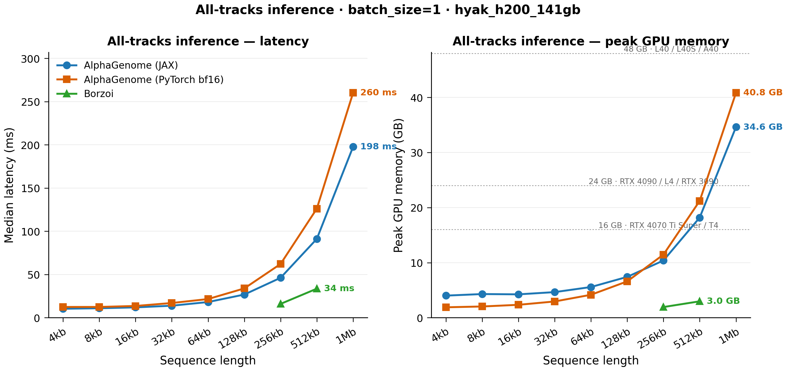


This post revisits AlphaGenome inference benchmarking after fixing an invalid comparison in the PyTorch timing path.

The refreshed April 6-9, 2026 runs show that the old shorthand claim that "PyTorch is 2-3x slower than JAX" no longer holds. On the updated benchmark, JAX is still clearly faster on `H200`, and it is usually faster from `128 kb` onward on `A100`, `L40S`, `L40`, and `A40`, but the gap is much smaller and short-context results are often mixed.

The practical conclusion is that the comparison is now good enough to use as an inference runtime audit, with the remaining caveat that this is still an official JAX implementation versus a community PyTorch port rather than a bitwise equivalence study.


---

## Why rerun the benchmark?

Our earlier benchmarking compared the native [JAX AlphaGenome implementation](https://github.com/google-deepmind/alphagenome_research) against [alphagenome-pytorch](https://github.com/genomicsxai/alphagenome-pytorch), but one detail made the comparison unfair: the PyTorch runner was timing backbone embeddings without registering the full reference output heads, while the JAX path was timing full prediction heads.

That is the main reason the older benchmark overstated the latency gap. The PyTorch launch post on this site focused on model parity, usability, and downstream workflows rather than this runtime issue, so this note is meant as a focused correction to the inference-performance story.

---

## What is aligned now?

The updated benchmark is much closer to an apples-to-apples runtime comparison:

* Same benchmark mode: inference only, `batch_size=1`, `3` warmup iterations, `10` timed iterations, and median latency reporting
* Same output scope: both frameworks benchmark full prediction-head work instead of timing only intermediate embeddings
* Same compiled execution intent: JAX runs under `@jax.jit`; PyTorch runs under `torch.compile` with bf16 autocast
* Same organism selection during timing: both paths use `organism_index=0`
* Same broad context sweep on supported cards: `4 kb` through `1 Mb` where the GPU fits the workload

The refreshed published inference runs are:

* `hyak_h200_141gb`: `20260409_a4c2c09_full_heads_inference`
* `hyak_a100_80gb`: `20260407_f1420a5_apple_to_apple_baseline`
* `hyak_l40s_48gb`: `20260407_f1420a5_apple_to_apple_baseline`
* `hyak_l40_48gb`: `20260407_f1420a5_apple_to_apple_baseline`
* `hyak_a40_48gb`: `20260407_f1420a5_apple_to_apple_baseline`
* `hyak_rtx6k_24gb`: `20260407_f1420a5_apple_to_apple_baseline`

---

## Latest published result summary

The table below summarizes the currently published inference comparison. Ratios are reported as **PyTorch / JAX** over the sequence lengths both frameworks completed on that GPU:

| GPU | Common seq lengths | Latency ratio | Memory ratio | Read |
| --- | --- | --- | --- | --- |
| `H200 141 GB` | `4 kb` to `1 Mb` | `1.14x` to `1.38x` | `0.47x` to `1.18x` | JAX is faster throughout; memory crosses over by `256 kb` |
| `A100 80 GB` | `4 kb` to `1 Mb` | `0.84x` to `1.13x` | `0.47x` to `1.13x` | Mixed at short contexts; JAX is faster from `128 kb` onward |
| `L40S 48 GB` | `4 kb` to `1 Mb` | `0.68x` to `1.24x` | `0.39x` to `1.14x` | Mixed at short contexts; JAX is faster from `128 kb` onward |
| `L40 48 GB` | `4 kb` to `1 Mb` | `0.77x` to `1.22x` | `0.39x` to `1.14x` | Mixed at short contexts; JAX is faster from `128 kb` onward |
| `A40 48 GB` | `4 kb` to `1 Mb` | `0.67x` to `1.17x` | `0.46x` to `1.14x` | Mixed at short contexts; JAX is faster from `128 kb` onward |
| `RTX 6000 24 GB` | PyTorch only | n/a | n/a | No JAX bf16 comparison on this card |

The previous one-line story that PyTorch is always dramatically slower is therefore no longer supported by the currently published runs. The updated picture is more nuanced: the biggest, cleanest JAX advantage appears on `H200`, while `A100` and the `48 GB` cards show mixed short-context behavior before JAX pulls ahead at longer contexts.

The `H200` rerun is the clearest example of the corrected comparison. Once full prediction heads are included on both sides, JAX remains faster across the whole `4 kb` to `1 Mb` sweep, but the gap is far smaller than the older benchmark implied.

---

## What is still not perfectly identical?

Even after this correction, the benchmark is still not a perfect implementation-level equivalence test:

* The JAX path is the official DeepMind implementation, while the PyTorch path is a community port
* JAX times a prebuilt bf16 one-hot tensor of shape `(batch, seq, 4)`, while PyTorch times prebuilt integer token IDs of shape `(batch, seq)`
* Software stacks still differ by platform, so cross-GPU interpretation should always be tied to the recorded environment for each run

Those caveats matter if you care about exact implementation identity. They matter much less if your question is the practical one: "How do compiled end-to-end AlphaGenome inference workloads behave on current NVIDIA GPUs?"

---

## Bottom line

For inference performance, the updated benchmark is now valid enough to call a practical apples-to-apples audit:

* both sides execute compiled AlphaGenome inference
* both sides include prediction-head work
* both sides are timed over the same sequence lengths whenever the GPU can support them

The current readout is:

* `H200`: JAX is faster throughout the published `4 kb` to `1 Mb` sweep
* `A100`, `L40S`, `L40`, and `A40`: short contexts are mixed, but JAX is faster on the `128 kb` to `1 Mb` range shown here
* Peak memory is no longer a simple "PyTorch is leaner" story; it crosses over with context length and GPU tier

That moves the main caveat away from "this benchmark is unfair" and toward the more honest interpretation: these are two different implementations of the same model family, benchmarked under much better workload parity than before.

---

## Further reading

* [Porting AlphaGenome to PyTorch](https://genomicsxai.github.io/blogs/2026-004/)
* [alphagenome-pytorch](https://github.com/genomicsxai/alphagenome-pytorch)
* [AlphaGenome Research (JAX)](https://github.com/google-deepmind/alphagenome_research)

---

## References

1. Avsec, Ž. et al. Advancing regulatory variant effect prediction with AlphaGenome. *Nature* **649** (2026).
2. Danila Bredikhin, Alejandro Buendia, Martin Kjellberg, Christopher Zou, Xinming Tu, Anshul Kundaje. "Porting AlphaGenome to PyTorch." *Genomics × AI Blog*, 10 March 2026. https://genomicsxai.github.io/blogs/2026-004/.
